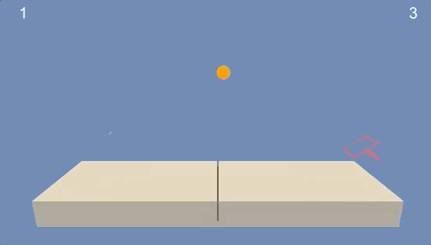

# Udacity Reinforcement Learning Collaboration Competition
Udacity Nanodegree Project 3 on Deep Reinforcement Learning Collaboration and Competition

The code is a modification of the Udacity helper code provided in the lectures.

### Environment Description:

  

Set-up: Two-player game where agents control rackets to bounce ball over a net.  
Goal: The agents must bounce ball between one another while not dropping or sending ball out of bounds.  
Agents: The environment contains two agent linked to a single Brain named TennisBrain. After training you can attach another Brain named MyBrain to one of the agent to play against your trained model.  
Agent Reward Function (independent):  
+0.1 To agent when hitting ball over net.  
-0.1 To agent who let ball hit their ground, or hit ball out of bounds.  
Brains: One Brain with the following observation/action space.  
Vector Observation space: 8 variables corresponding to position and velocity of ball and racket.The observation space consists of 8 variables corresponding to the position and velocity of the ball and racket
Vector Action space: (Continuous) Size of 2, corresponding to movement toward net or away from net, and jumping.  
Visual Observations: None.  
Reset Parameters: One, corresponding to size of ball.  
Target Goal: verage score of +0.5 (over 100 consecutive episodes, after taking the maximum over both agents).  

Details about this environment can be found here: https://github.com/Unity-Technologies/ml-agents/blob/master/docs/Learning-Environment-Examples.md#tennis  

### Environment Download Instructions:
For this project, you will not need to install Unity - this is because we have already built the environment for you, and you can download it from one of the links below. You need only select the environment that matches your operating system:  

Linux: https://s3-us-west-1.amazonaws.com/udacity-drlnd/P3/Tennis/Tennis_Linux.zip  
Mac OSX: https://s3-us-west-1.amazonaws.com/udacity-drlnd/P3/Tennis/Tennis.app.zip  
Windows (32-bit): https://s3-us-west-1.amazonaws.com/udacity-drlnd/P3/Tennis/Tennis_Windows_x86.zip  
Windows (64-bit): https://s3-us-west-1.amazonaws.com/udacity-drlnd/P3/Tennis/Tennis_Windows_x86_64.zip  

### Repository Description:

Tennis.app the environment  
model.py: contains the actor and critic NN which is composed of fully connected NN with 2 hidden layers (2  56, 128).  
Saved_Model/checkpoint_actor.pth & Saved_Model/checkpoint_critic.pth: contains the saved Weights.  
Collaboration and Competition.ipynb: jupyter notebook environment to train the environment.  
Report.md: Contains the analysis report.  
run.py: to test the trained network.  
train.py: contains the agent description.  
