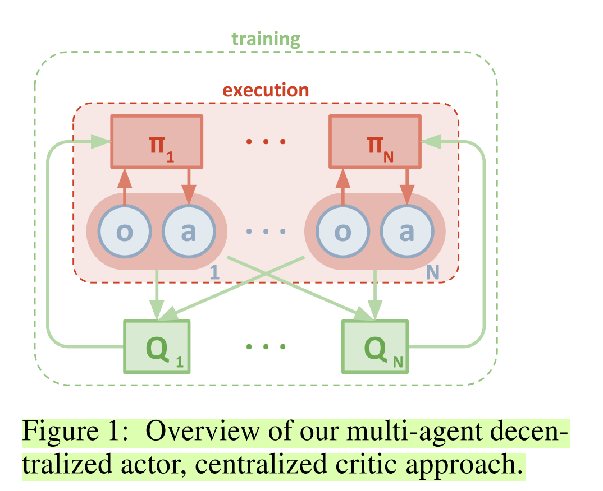
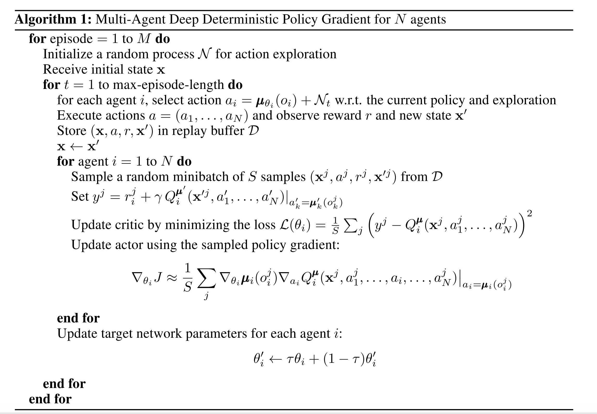
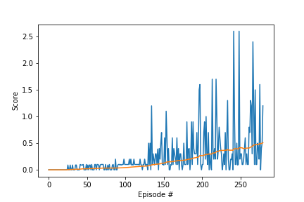
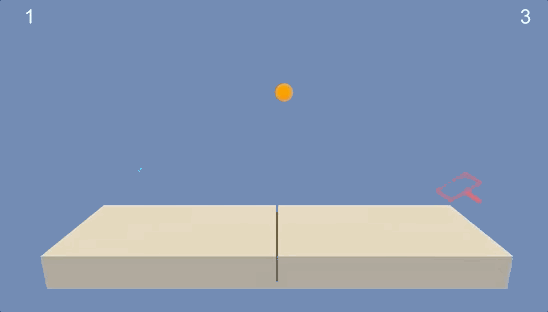

# Reinforcement Learning Collaboration and Competition Report:

## Method Description:
Architecture of the algorithm:
We used Multi-Agent Deep Deterministic Policy Gradient

### Algorithm Description:

Centralized critic is key point in this algorithm. The easiest approach is opposed to the pervious projects where all networks are grouped in agent object here we separate the training and train each actor and the centralized critic separately in the notebook.
  

The algorithm can be summarized with the following  
  

### Hyperparameters Used
BUFFER_SIZE = int(1e6)  # replay buffer size
BATCH_SIZE = 128        # minibatch size
GAMMA = 0.99            # discount factor
TAU = 2e-1              # for soft update of target parameters
LR_ACTOR = 1e-4         # learning rate of the actor
LR_CRITIC = 3e-4        # learning rate of the critic
WEIGHT_DECAY = 0        # L2 weight decay

ADD_NOISE = True
SEED = 2

N_EPISODES = 3000

### All four networks structure: two hidden layers with size (512, 256)
fc1_units = 512
fc2_units = 256

### Results of the analysis:
Episode 0	Average Score: 0.00  
Episode 100	Average Score: 0.01  
Episode 200	Average Score: 0.03  
Episode 300	Average Score: 0.09  
Episode 400	Average Score: 0.11  
Episode 500	Average Score: 0.12  
Episode 600	Average Score: 0.15  
Episode 700	Average Score: 0.19  
Episode 800	Average Score: 0.21  
Episode 900	Average Score: 0.27  
Episode 1000	Average Score: 0.20  
Episode 1100	Average Score: 0.24  
Episode 1200	Average Score: 0.29  
Episode 1300	Average Score: 0.31  
Episode 1377	Average Score: 0.52  
Environment solved in 1277 episodes!	Average Score: 0.52   

  

  

### Future next steps:
We can consider improving performance by using ensemble policies and hierarchical deep reinforcement learning. It would be also be of interest to test the same methods on different environments with different interactions between agents.  

### References:
1. Mnih V, Puigdomènech Badia A, Mirza M, et al. Asynchronous Methods for Deep Reinforcement Learning.; 2016. https://arxiv.org/pdf/1602.01783.pdf. Accessed April 15, 2019.

2. Barth-Maron G, Hoffman MW, Budden D, et al. Distributed Distributional Deterministic Policy Gradients. 2018:1-16. http://arxiv.org/abs/1804.08617.

3. Rudy Gilman. Intuitive RL: Intro to Advantage-Actor-Critic (A2C). https://hackernoon.com/intuitive-rl-intro-to-advantage-actor-critic-a2c-4ff545978752. Accessed May 5, 2019.

4. Arthur Juliani. Simple Reinforcement Learning with Tensorflow Part 8: Asynchronous Actor-Critic Agents (A3C). https://medium.com/emergent-future/simple-reinforcement-learning-with-tensorflow-part-8-asynchronous-actor-critic-agents-a3c-c88f72a5e9f2. Accessed May 5, 2019.  

5. Shyam Choudhary. Multi-Agent Reinforcement Learning in Beer Distribution Game. https://medium.com/@SYM0920/multi-agent-reinforcement-learning-in-beer-distribution-game-6c77c9b1dc4. Accessed May 7, 2019.  

6. Lowe R, Wu Y, Tamar A, et al. Multi-Agent Actor-Critic for Mixed Cooperative-Competitive Environments. https://arxiv.org/pdf/1706.02275.pdf. Accessed May 7, 2019.  
